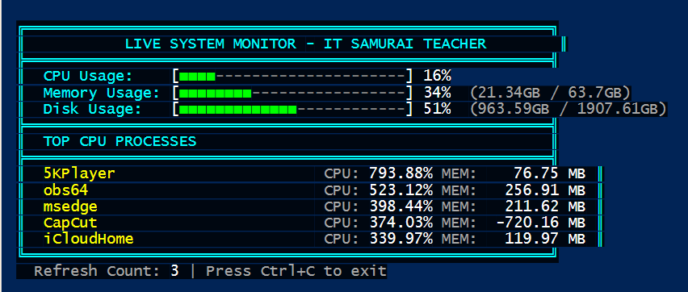

# PowerShell Live System Monitor
[](https://www.youtube.com/@ITSamuraiTeacher)
[](https://samuraiteacher.com/)

A real-time system monitoring dashboard built in PowerShell that provides live tracking of system resources.



## Features
- Real-time CPU usage monitoring with color alerts
- Memory (RAM) utilization tracking
- Disk space monitoring
- Top 5 CPU-intensive processes
- Auto-refresh every 2 seconds

## Quick Start
1. Download `live-system-monitor.ps1`
2. Open PowerShell as Administrator
3. Navigate to script location
4. Run:
```powershell
.\live-system-monitor.ps1
```

## Requirements
- Windows PowerShell 5.1 or later
- Administrator privileges

## Author
Created by IT Samurai Teacher
- 📺 [YouTube Channel](https://www.youtube.com/@ITSamuraiTeacher)
- 🌐 [Website](https://samuraiteacher.com/)

## License
MIT License - See [LICENSE](LICENSE) file

## Support
- ⭐ Star this repository
- 💻 Follow for more tech tutorials
- 🎥 Subscribe to [IT Samurai Teacher](https://www.youtube.com/@ITSamuraiTeacher)
